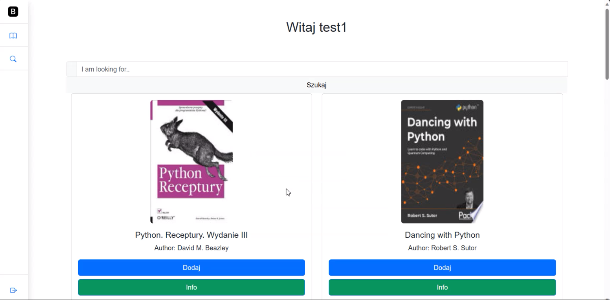
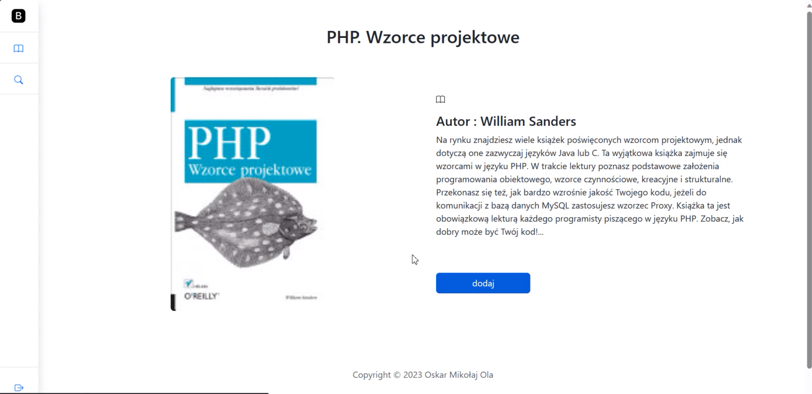
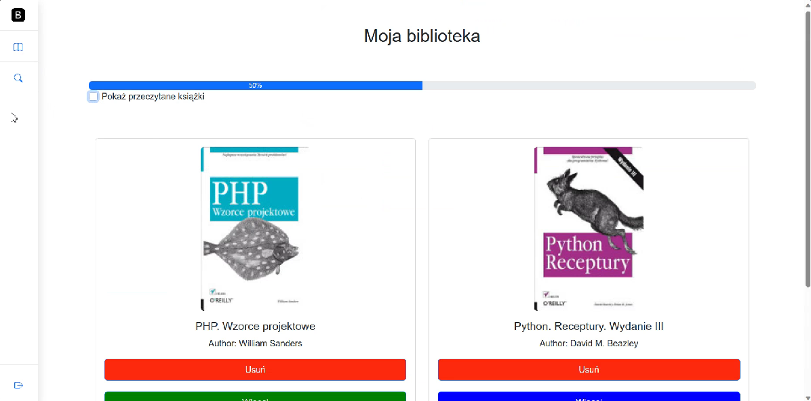
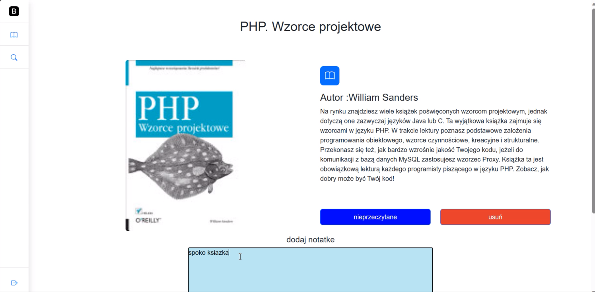
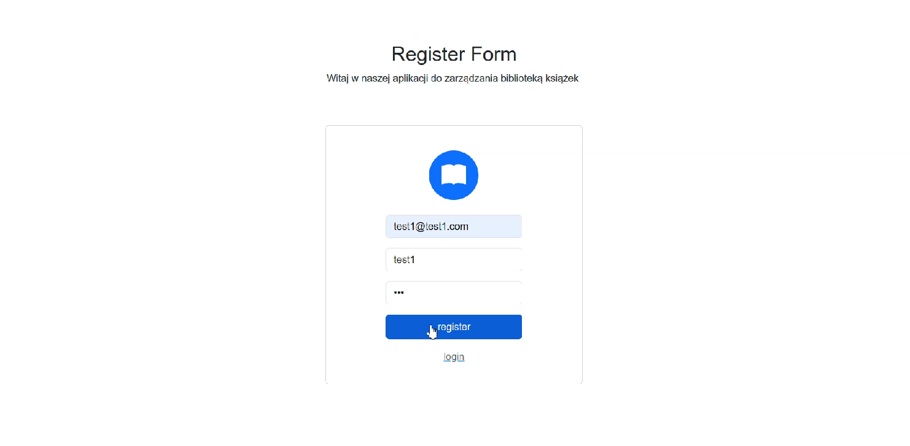
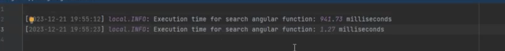

# GoogleBooksManager

## Description

This is a simple monolithic application that allows you to manage your books. You can add, edit, delete and search for books. The application uses Google Books API to search for books and get their details.
Project was made as the final project for the course "Programming in PHP" at the University.

________________________________

* Main page - shows all books retrieved from Google Books API. You can search for different books by typing in the search bar and clicking the search button. You can also add books to your collection by clicking the "Add" button. You can also view details about book or add to you book collection.

___________________________

* Book details - shows details about the book. By clicking "Dodaj" button you can add book to your collection.
  

_______________________

* My collection of books - shows all books that you added to your collection. You can set book as read and filter them or delete it from your collection. Moreover, you can add your own notes.
  

____________________

* Authentication - you can log in or register.
  

___________________

* Searching for new book also supports caching - if you search for the same book again, it will be retrieved from the cache not from Google Books API. Below is a screenshot from searching "Angular books"

______________________________

* Main Controller which is responsible for handling GoogleApi

The PageController is a controller in a Laravel application that manages the operations related to books. It interacts with the Google Books API to fetch book data and uses Laravel's Cache facade to cache the responses. Here's a brief description of its methods:  

* index(): Fetches a list of books based on a predefined query (default is 'python') from the Google Books API or from the cache if available. It then returns the 'index' view with the fetched books and the authenticated user's name.  

* search(Request $request): Takes a search query from the request, fetches the corresponding books from the Google Books API or from the cache if available, and returns the 'index' view with the fetched books and the authenticated user's name.  

* store($id): Fetches the details of a specific book from the Google Books API or from the cache if available, and stores the book details in the database.  

* storeBookDetails($bookData): A helper method that stores the details of a book in the database.  

* checkCorrect($bookData): A helper method that checks and corrects the book data before storing it in the database.  

* bookDetails($id): Fetches the details of a specific book from the Google Books API or from the cache if available, and returns the 'bookDetails' view with the fetched book data.  

* delete($id): Deletes a specific book from the database and redirects to the '/myBooks' route with a success message.  

* show(): Retrieves all books associated with the authenticated user from the database and returns the 'MyBooks' view with the fetched books and the percentage of books marked as read.  

* myBooksDetails($id): Retrieves the details of a specific book from the database and returns the 'myBooksDetails' view with the fetched book data if the authenticated user is authorized to view the book.  

* update(Request $request, $id): Updates the note of a specific book in the database and redirects to the '/myBooks' route with a success message.  

* updateRead($id): Toggles the read status of a specific book in the database and redirects to the '/myBooks/myBooksDetails/'.$id route with a success message.  

* login(): Returns the 'login' view.  

* register(): Returns the 'register' view.
